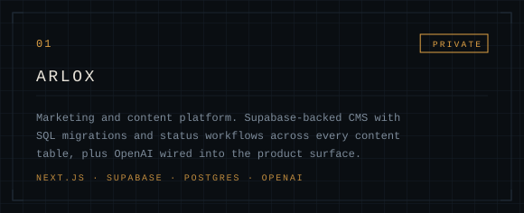
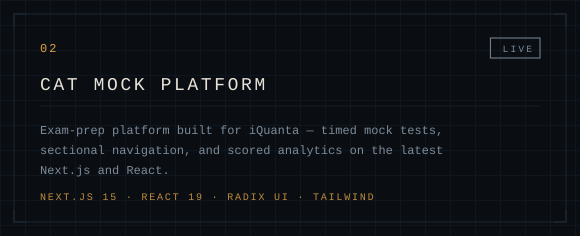
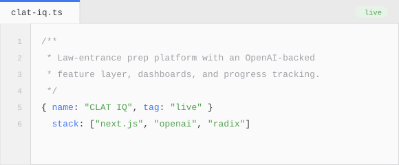
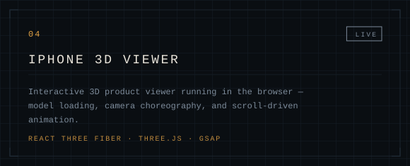
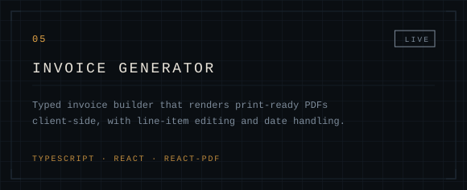
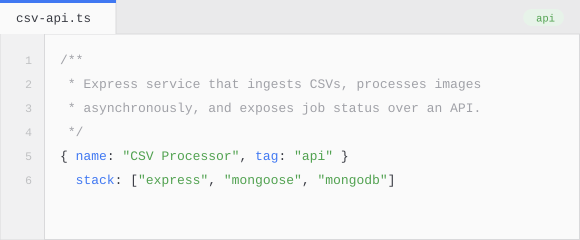
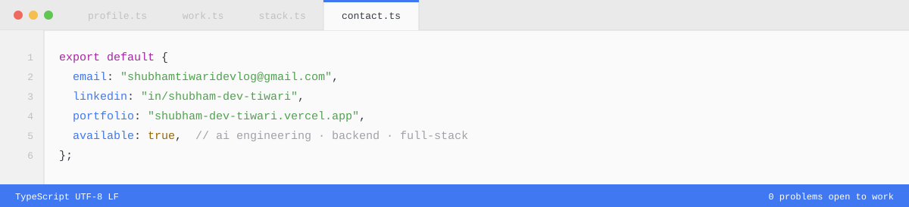

<samp>

[LinkedIn](https://www.linkedin.com/in/shubham-dev-tiwari/) &nbsp;·&nbsp; [Portfolio](https://shubham-dev-tiwari.vercel.app/) &nbsp;·&nbsp; [Email](mailto:your.email@example.com)

</samp>

I build web applications, and I put AI inside them — the part that survives contact with real users, not the demo.

Day to day that means two layers. The **orchestration layer**, where a request gets decomposed, routed across agents and tools, and verified before anything reaches a user. And the **data layer** underneath it, where Supabase handles auth, Postgres, and content. The product surface on top is React and Next.js.

One and a half years in. Long enough to have shipped things, short enough to still be annoyed by my own old code.

 

A planner decomposes the request. Specialized agents run in parallel, each with a narrow tool surface. Synthesis merges their output and verifies it before anything is returned. Failures stay contained to one branch instead of poisoning the whole answer.

This is my professional work and the code is private, so there is no repo to link. What I own inside it:

`Claude Skills` — packaged instructions and scripts that give an agent a repeatable capability, versioned in the repo and reviewed like any other code. Beats re-prompting it every run.

`MCP servers` — typed tool servers exposing internal APIs and databases, so an agent gets a contract instead of a scraped response.

`Retrieval` — chunking and embedding pipelines, hybrid semantic and keyword search, reranked before it touches the context window.

`Guardrails` — structured output validation, token budgeting, prompt caching, and evaluation sets that catch regressions before a deploy does.

 

 

<table border="0">
<tr>
<td width="50%" valign="top"><samp>private repository</samp></td>
<td width="50%" valign="top"><samp><a href="https://cat-mock-iquanta.vercel.app">live</a> · <a href="https://github.com/shubham-dev-tiwari/cat-mock-iquanta">source</a></samp></td>
</tr>
<tr>
<td width="50%" valign="top"><samp><a href="https://clat-iq-6ae4.vercel.app/">live</a> · <a href="https://github.com/shubham-dev-tiwari/clat-iq">source</a></samp></td>
<td width="50%" valign="top"><samp><a href="https://i-phone-three-hazel.vercel.app/">live</a> · <a href="https://github.com/shubham-dev-tiwari/iPhone">source</a></samp></td>
</tr>
<tr>
<td width="50%" valign="top"><samp><a href="https://invoice-genrator-tawny.vercel.app">live</a> · <a href="https://github.com/shubham-dev-tiwari/invoice-genrator">source</a></samp></td>
<td width="50%" valign="top"><samp><a href="https://github.com/shubham-dev-tiwari/backend-assign">source</a></samp></td>
</tr>
</table>

 

<samp>

`platforms`  [NEET Mock](https://mock-neet-pi.vercel.app) · [NEET](https://neet-khaki.vercel.app) · [Better Call ALP](https://bettercallalp-phi.vercel.app) · [Educator Portfolio](https://bettercallalp.vercel.app) · [Nexus](https://nexus-sigma-ten.vercel.app/)

`commerce`  [Audiophile](https://audiophile-ecommerce-mbart13.vercel.app/) · [Aura Bazar](https://aurabazar.vercel.app) · [E-Commerce](https://e-commerce--one.vercel.app) · [Nykaa Clone](https://nykaa-clone-lovat.vercel.app)

`dashboards`  [CRM Stats](https://crm-stats-ashen.vercel.app) · [Frontend Dashboard](https://frontend-dashboard-ruddy.vercel.app/)

`sites`  [King Sukh](https://king-sukh-pearl.vercel.app) · [Bhairava](https://bhairava.vercel.app) · [Ritu Chakra](https://ritu-chakra.vercel.app) · [Word Counter](https://word-counter-two-delta.vercel.app)

`tools`  [WhatsApp Translator](https://github.com/shubham-dev-tiwari/whatsapp-translator) · [Cars](https://github.com/shubham-dev-tiwari/cars)

`go`  [Crud-Api](https://github.com/shubham-dev-tiwari/Crud-Api) · [go_echo](https://github.com/shubham-dev-tiwari/go_echo) · [Cryptography](https://github.com/shubham-dev-tiwari/Cryptography-With-Go) · [Discord Bot](https://github.com/shubham-dev-tiwari/discord_bot) · [Translator CLI](https://github.com/shubham-dev-tiwari/Google-Translator-in-Go) · [ChatGPT CLI](https://github.com/shubham-dev-tiwari/chat_gpt_with_go)

</samp>

 

 

<samp>

[LinkedIn](https://www.linkedin.com/in/shubham-dev-tiwari/) &nbsp;·&nbsp; [Portfolio](https://shubham-dev-tiwari.vercel.app/) &nbsp;·&nbsp; [your.email@example.com](mailto:your.email@example.com)

</samp>
