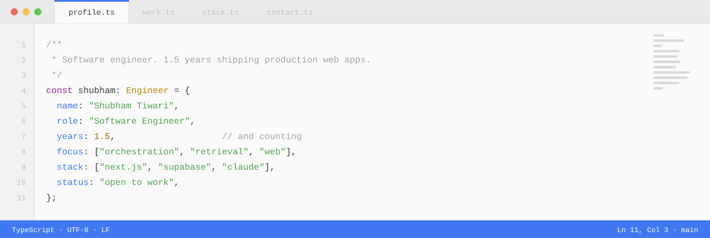
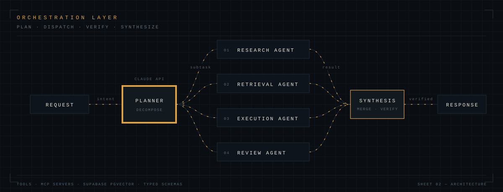
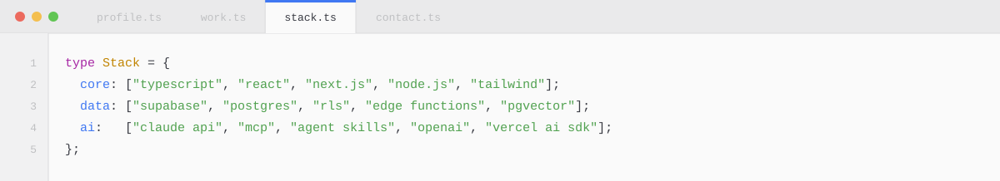

<samp>

[LinkedIn](https://www.linkedin.com/in/shubham-dev-tiwari/) &nbsp;·&nbsp; [Portfolio](https://shubham-dev-tiwari.vercel.app/) &nbsp;·&nbsp; [Email](mailto:your.email@example.com)

</samp>

---

I build web applications, and I put AI inside them — the part that survives contact with real users, not the demo.

Day to day that means two layers. The **orchestration layer**, where a request gets decomposed, routed across agents and tools, and verified before anything reaches a user. And the **data layer** underneath it, where Supabase handles auth, Postgres, and content. The product surface on top is React and Next.js.

One and a half years in. Long enough to have shipped things, short enough to still be annoyed by my own old code.

 

## The thing I keep building

A planner decomposes the request. Specialized agents run in parallel, each with a narrow tool surface. Synthesis merges their output and verifies it before anything is returned. Failures stay contained to one branch instead of poisoning the whole answer.

This is my professional work and the code is private, so there is no repo to link. What I own inside it:

`Claude Skills` — packaged instructions and scripts that give an agent a repeatable capability, versioned in the repo and reviewed like any other code. Beats re-prompting it every run.

`MCP servers` — typed tool servers exposing internal APIs and databases, so an agent gets a contract instead of a scraped response.

`Retrieval` — chunking and embedding pipelines, hybrid semantic and keyword search, reranked before it touches the context window.

`Guardrails` — structured output validation, token budgeting, prompt caching, and evaluation sets that catch regressions before a deploy does.

 

## Stack

 

## Selected work

<table>
<tr>
<td width="50%" valign="top">

**`01`** &nbsp; **Arlox** &nbsp; <samp>— professional, private</samp>

Marketing and content platform. Supabase-backed CMS with SQL migrations and status workflows across every content table, plus OpenAI integration on the product side.

<samp>Next.js · Supabase · Postgres · OpenAI</samp>

<samp>private repository</samp>

</td>
<td width="50%" valign="top">

**`02`** &nbsp; **CAT Mock Test Platform**

Full exam-prep platform built for iQuanta — timed mock tests, sectional navigation, and scored analytics on Next.js 15 and React 19.

<samp>Next.js 15 · React 19 · Radix UI · Tailwind</samp>

[live](https://cat-mock-iquanta.vercel.app) &nbsp;·&nbsp; [source](https://github.com/shubham-dev-tiwari/cat-mock-iquanta)

</td>
</tr>
<tr>
<td width="50%" valign="top">

**`03`** &nbsp; **CLAT IQ**

Law-entrance prep platform with an OpenAI-backed feature layer, dashboards, progress tracking, and a full Radix component system.

<samp>Next.js · OpenAI · Radix UI · Tailwind</samp>

[live](https://clat-iq-6ae4.vercel.app/) &nbsp;·&nbsp; [source](https://github.com/shubham-dev-tiwari/clat-iq)

</td>
<td width="50%" valign="top">

**`04`** &nbsp; **iPhone 3D Viewer**

Interactive 3D product viewer running in the browser — model loading, camera choreography, and scroll-driven animation.

<samp>React Three Fiber · Three.js · GSAP</samp>

[live](https://i-phone-three-hazel.vercel.app/) &nbsp;·&nbsp; [source](https://github.com/shubham-dev-tiwari/iPhone)

</td>
</tr>
<tr>
<td width="50%" valign="top">

**`05`** &nbsp; **Invoice Generator**

Typed invoice builder that renders print-ready PDFs client-side, with line-item editing and date handling.

<samp>TypeScript · React · react-pdf</samp>

[live](https://invoice-genrator-tawny.vercel.app) &nbsp;·&nbsp; [source](https://github.com/shubham-dev-tiwari/invoice-genrator)

</td>
<td width="50%" valign="top">

**`06`** &nbsp; **CSV Image Processor API**

Express service that ingests CSVs, processes images asynchronously, and exposes status through a two-endpoint API.

<samp>Express · Mongoose · MongoDB</samp>

<samp>backend</samp> &nbsp;·&nbsp; [source](https://github.com/shubham-dev-tiwari/backend-assign)

</td>
</tr>
</table>

 

## Archive

<samp>

**Platforms & products**

| | | |
|:--|:--|:--|
| [NEET Mock Platform](https://github.com/shubham-dev-tiwari/mock) | Next.js mock-test engine for NEET aspirants | [live](https://mock-neet-pi.vercel.app) |
| [NEET](https://github.com/shubham-dev-tiwari/Neet) | Companion prep platform, Next.js | [live](https://neet-khaki.vercel.app) |
| [Better Call ALP](https://github.com/shubham-dev-tiwari/bettercallalp) | Educator brand site, React + Tailwind | [live](https://bettercallalp-phi.vercel.app) |
| [Educator Portfolio](https://github.com/shubham-dev-tiwari/educator-portfolio) | Portfolio build for an educator client | [live](https://bettercallalp.vercel.app) |
| [Nexus](https://github.com/shubham-dev-tiwari/Nexus) | Interactive multi-feature web application | [live](https://nexus-sigma-ten.vercel.app/) |

**Commerce & dashboards**

| | | |
|:--|:--|:--|
| [Audiophile](https://github.com/shubham-dev-tiwari/audiophile) | TypeScript e-commerce storefront with cart and checkout | [live](https://audiophile-ecommerce-mbart13.vercel.app/) |
| [Aura Bazar](https://github.com/shubham-dev-tiwari/Ecommerce) | React storefront | [live](https://aurabazar.vercel.app) |
| [E-Commerce](https://github.com/shubham-dev-tiwari/e-commerce-) | Full-stack storefront, React + Vite + Material UI | [live](https://e-commerce--one.vercel.app) |
| [Nykaa Clone](https://github.com/shubham-dev-tiwari/nykaa-clone) | Beauty-retail UI rebuild | [live](https://nykaa-clone-lovat.vercel.app) |
| [CRM Stats](https://github.com/shubham-dev-tiwari/CRM-Stats-) | CRM analytics dashboard | [live](https://crm-stats-ashen.vercel.app) |
| [Frontend Dashboard](https://github.com/shubham-dev-tiwari/frontend-dashboard) | Redux Toolkit dashboard | [live](https://frontend-dashboard-ruddy.vercel.app/) |

**Sites & utilities**

| | | |
|:--|:--|:--|
| [King Sukh](https://github.com/shubham-dev-tiwari/king-sukh) | Responsive site with animation-led layout | [live](https://king-sukh-pearl.vercel.app) |
| [Bhairava](https://github.com/shubham-dev-tiwari/Bhairava) | CSS-driven experience site | [live](https://bhairava.vercel.app) |
| [Ritu Chakra](https://github.com/shubham-dev-tiwari/Ritu-chakra) | Weather app with a personality | [live](https://ritu-chakra.vercel.app) |
| [Word Counter](https://github.com/shubham-dev-tiwari/word-counter) | Text analysis utility | [live](https://word-counter-two-delta.vercel.app) |
| [WhatsApp Translator](https://github.com/shubham-dev-tiwari/whatsapp-translator) | Chrome extension — real-time WhatsApp Web translation | — |
| [Cars](https://github.com/shubham-dev-tiwari/cars) | TypeScript car-listing UI | — |

**Go**

| | |
|:--|:--|
| [Crud-Api](https://github.com/shubham-dev-tiwari/Crud-Api) | REST CRUD service in Go |
| [go_echo](https://github.com/shubham-dev-tiwari/go_echo) | Echo framework server |
| [Cryptography-With-Go](https://github.com/shubham-dev-tiwari/Cryptography-With-Go) | Encryption primitives, hands-on |
| [discord_bot](https://github.com/shubham-dev-tiwari/discord_bot) | Discord bot |
| [Google-Translator-in-Go](https://github.com/shubham-dev-tiwari/Google-Translator-in-Go) | Translation CLI |
| [chat_gpt_with_go](https://github.com/shubham-dev-tiwari/chat_gpt_with_go) | ChatGPT from the terminal |

</samp>

 

## Signal

 

## Open to

AI engineering, backend, and full-stack roles. Also happy to talk to anyone building agents, retrieval systems, or something that has no clean answer yet.

<samp>

[LinkedIn](https://www.linkedin.com/in/shubham-dev-tiwari/) &nbsp;·&nbsp; [Portfolio](https://shubham-dev-tiwari.vercel.app/) &nbsp;·&nbsp; [your.email@example.com](mailto:your.email@example.com)

</samp>
